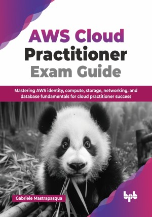

# AWS Cloud Practitioner Exam Guide

Mastering AWS identity, compute, storage, networking, and database fundamentals for cloud practitioner success.

This is the repository for [AWS Cloud Practitioner Exam Guide
](https://bpbonline.com/products/aws-cloud-practitioner-exam-guide?variant=44618938581192),published by BPB Publications.

## About the Book
Amazon Web Services (AWS) stands as the preeminent cloud computing platform, offering a comprehensive suite of services for diverse technological requirements. This AWS Cloud Practitioner Exam Guide serves as a structured and rigorous resource for comprehending the foundational principles of AWS and effectively preparing for the Cloud Practitioner Certification examination.

This guide introduces core cloud computing paradigms, the Global Infrastructure of AWS encompassing regions, Availability Zones, and content delivery mechanisms via CloudFront and Edge Locations. It examines cloud deployment, the AWS Well-Architected Framework for resilient, scalable solutions, and secure access via IAM. Essential compute (EC2, Lambda), storage (S3, EBS), databases (RDS, DynamoDB), networking (VPC), security, event-driven architectures (SQS, SNS), monitoring (CloudWatch), infrastructure automation (CloudFormation), cost management, advanced identity (Cognito), and other AWS offerings for exam preparation are also covered. It also covers event-driven architectures with SQS and SNS, monitoring with CloudWatch, automation via CloudFormation, cost management, advanced identity with Cognito, and key AWS services aligned with exam goals.

Upon completing this guide, you'll gain a solid foundation in AWS services and concepts, preparing you to confidently pass the AWS Cloud Practitioner exam and articulate key cloud value propositions. This book is your step-by-step path to launching a career in cloud engineering, solutions architecture, DevOps, or cloud support.

## What You Will Learn
• Implementing AWS security best practices, encryption, key management, compliance, and auditing.

• Content delivery with CloudFront, event-driven architectures using SQS and SNS messaging.

• Monitoring AWS resources with CloudWatch and infrastructure automation using CloudFormation and CDK.

• Cloud fundamentals, AWS Global Infrastructure, deployment models, and the Well-Architected Framework.

• Core AWS compute services like EC2 instances, containers with ECS, and serverless Lambda.

• Relational (RDS, Aurora) and NoSQL (DynamoDB) database services and analytical tools (Redshift).
